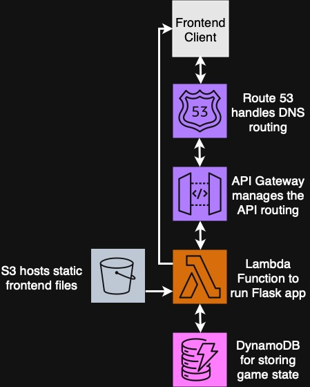
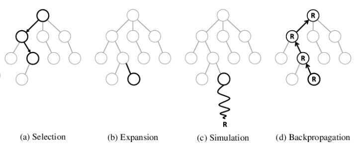

# MurlanBot

The program is deployed on a website using AWS Lambda to run a Flask app packaged using Zappa, with other AWS services used to facilitate the API calls and custom domain, namely API Gateway and Route 53.

This project utilises Monte Carlo Tree Search (MCTS) to create a bot capable of playing shedding-style card games https://en.wikipedia.org/wiki/List_of_shedding-type_games - in this project the game is Murlan.

In these types of games, it is not always optimal to play the lowest card possible at each turn. For example, if Player 1 has a 3 and a 6, and Player 2 has a 4 and a 7, if P2 played 4 instead of 7 if P1 plays 3, P2 would lose. This means that a more sophisticated algorithm is needed for the bot to play more optimally.

The game can be played at https://murlanbot.xyz

## System Diagram

A full serverless microservices-based approach was used to minimise time spent on deployment, with most of the development time focused on developing the bot itself. Lambda functions reduce baseline costs as no VMs are constantly on.

Zappa is used to deploy the Flask app to an AWS Lambda function.

## Initial MCTS Development and Refactoring 

MCTS works by exploring possible moves at each turn and then selecting the move with the highest probability of winning. The MCTS code was developed using the following tutorial as a guide and initial starting point: https://www.harrycodes.com/blog/monte-carlo-tree-search

In the case of shedding games however, the opponent's card are not known, and so the algorithm works by generating a possible hand based on the cards already seen.

(Image from https://spl.hevs.io/spl-docs/computerscience/algorithms/mcts.html)

The bot and gameplay was initially developed as a command line script, however major refactoring was needed to allow the scripts to run in a serverless and 'blocking' environment. This meant refactoring the code so it accepts a game state from a database and returns a new game state.

## CI/CD Implementation

GitHub Actions was utilised to implement the following CI/CD flow on a 'git push' to a feature branch:
1. Update staging Lambda function using Zappa
2. Perform integration test to ensure correct functionality
3. If this succeeds, merge the file to the main branch
4. Update the main deployment

## Conclusion

The initial bot seems to function well, however in some cases it makes plays that are questionable to experienced players which result in it losing with a hand that should win. The project itself has a massive possible scope, with projects such as AlphaGo showing how deep learning can be used to make very effective bots.
